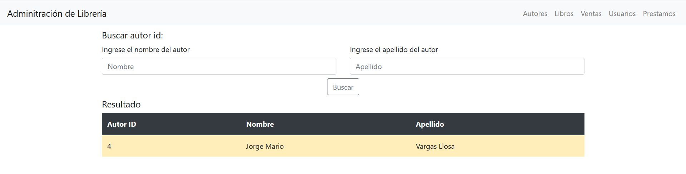

# **Adminitrador de una librería**

Este proyecto se usó las tecnologías de Mysql, Python3-flask y bootstrap 4.
## **Diseño que se implementará en nuestra base de datos mysql**


## **Para poder replicar este proyecto de seguir los siguientes pasos:**

1. Debe tener instalado mysql V.10 o superior
2. Para tener configurado automaticamente todo cargamos el siguiente archivo al base de datos
    ```
    C:> mysql -u root -h localhost -p < definition.sql
    ```
3. O lo hacemos de la manera manual, creamos una base de datos con el nombre 'Libreria_Flask'
    ```
    CREATE DATABASE Libreria_Flask
    ```
4. Usamos la base de datos creada
    ```
    USE Libreria_Flask
    ```
5. Creamos las tablas definas en el archivo definition.sql
    ```
    CREATE TABLE autores(
    autor_id INTEGER UNSIGNED PRIMARY KEY AUTO_INCREMENT,
    nombre VARCHAR(30) NOT NULL,
    apellido VARCHAR(30) NOT NULL,
    seudonimo VARCHAR(30) NOT NULL,
    genero ENUM('M','F'),
    pais_origen VARCHAR(30) NOT NULL,
    fecha_creacion DATETIME DEFAULT current_timestamp
    );
    ```
    ```
    CREATE TABLE libros(
    libro_id INTEGER UNSIGNED PRIMARY KEY AUTO_INCREMENT,
    autor_id INT UNSIGNED NOT NULL,
    titulo VARCHAR(100) NOT NULL,
    descripcion VARCHAR(50) NOT NULL,
    fecha_publicacion DATE NOT NULL,
    ventas INT UNSIGNED NOT NULL,
    stock INT UNSIGNED NOT NULL, 
    FOREIGN KEY (autor_id) REFERENCES autores(autor_id)
    );
    ```
    ```
    CREATE TABLE usuarios(
    usuario_id INTEGER UNSIGNED PRIMARY KEY AUTO_INCREMENT,
    nombre VARCHAR(30) NOT NULL,
    apellido VARCHAR(30) NOT NULL,
    username VARCHAR(30) NOT NULL,
    email VARCHAR(30) NOT NULL,
    fecha_creacion DATETIME DEFAULT current_timestamp
    );
    ```
    ```
    CREATE TABLE prestamos_usuarios(
    usuario_id INTEGER UNSIGNED NOT NULL,
    nombre VARCHAR(30) NOT NULL,
    email VARCHAR(30) NOT NULL,
    username VARCHAR(39) NOT NULL,
    total_prestamos INT UNSIGNED NOT NULL,
    FOREIGN KEY (usuario_id) REFERENCES usuarios(usuario_id)
    );
    ```
    ```
    CREATE TABLE libros_usuario(
    libro_id INT UNSIGNED NOT NULL,
    usuario_id INT UNSIGNED NOT NULL,
    
    FOREIGN KEY (libro_id) REFERENCES libros(libro_id),
    FOREIGN KEY (usuario_id) REFERENCES usuarios(usuario_id),
    fecha_creacion DATETIME DEFAULT current_timestamp
    );
    ```
    

6. Luego cargamos los procedures hecho de archivo 'definition.sql'

    - Este PROCEDURE se encarga de si sucede un prestamo de un libro entonces actualiza los campos de las tablas.

    ```
    DELIMITER //
    CREATE PROCEDURE prestamo(libro_id INT, usuario_id INT)
    BEGIN
        SET @cantidad = (SELECT stock FROM libros WHERE libros.libro_id = libro_id);
        
        IF @cantidad > 0 THEN
            INSERT INTO libros_usuario(libro_id,usuario_id) VALUES (libro_id,usuario_id);
            UPDATE libros SET stock = stock -1 WHERE libros.libro_id = libro_id;

            SET @exist = (SELECT COUNT(*) FROM prestamos_usuarios WHERE prestamos_usuarios.usuario_id = usuario_id);

            IF @exist = 0 THEN
                SET @nombre = (SELECT nombre FROM usuarios WHERE usuarios.usuario_id = usuario_id);
                SET @email = (SELECT email FROM usuarios WHERE usuarios.usuario_id = usuario_id);
                SET @username = (SELECT username FROM usuarios WHERE usuarios.usuario_id = usuario_id);
                INSERT INTO prestamos_usuarios(usuario_id,nombre,email,username,total_prestamos) VALUES (usuario_id,@nombre,@email,@username,1);
            ELSE
                UPDATE prestamos_usuarios set total_prestamos = total_prestamos + 1 WHERE prestamos_usuarios.usuario_id = usuario_id;
            END IF;

        ELSE
            UPDATE libros SET descripcion = 'No disponible' WHERE libros.libro_id = libro_id; 
            SELECT "No es posible realizar el prestamo" AS mensaje_error;
        END IF;
    END//
    DELIMITER ;
    ```
    - Este PROCEDURE se encarga de si sucede una venta de un libro entonces este actuliza las tablas correspondientes.
    ```
    DELIMITER //
    CREATE PROCEDURE venta(libro_id INT)
    BEGIN
        SET @cantidad = (SELECT stock FROM libros WHERE libros.libro_id = libro_id);

        IF @cantidad > 0 THEN
            UPDATE libros SET stock = stock - 1 WHERE libros.libro_id = libro_id;
            UPDATE libros SET ventas = ventas + 1 WHERE libros.libro_id = libro_id;
        ELSE
            UPDATE libros SET descripcion = 'No disponible' WHERE libros.libro_id = libro_id;
            SELECT "No se cuenta con stock" AS mensaje_error;
        END IF;

    END//
    DELIMITER ;
    ```
    - Este PROCEDURE se encarga de sucede una devolución de un libro, actulizando las tablas necesarias.
    ```
    DELIMITER //
    CREATE PROCEDURE devolucion_libro(libro_id INT, usuario_id INT) 
    BEGIN 
        SET @cantidad = (SELECT stock FROM libros WHERE libros.libro_id = libro_id);

        DELETE FROM libros_usuario WHERE libros_usuario.libro_id = libro_id AND libros_usuario.usuario_id = usuario_id;
        UPDATE libros SET stock = stock + 1 WHERE libros.libro_id = libro_id;

        IF @cantidad = 0 THEN
            UPDATE libros SET descripcion = 'Disponible' WHERE libros.libro_id = libro_id;
        END IF;

    END//
    DELIMITER ;
    ```
    - Este PROCEDURE se encarga de si queremos aumentar el stock de un libro, actualizando las tablas necesarias.
    ```
    DELIMITER //
    CREATE PROCEDURE aumentar_stock(libro_id INT, cantidad INT)
    BEGIN
        UPDATE libros SET stock = stock + cantidad WHERE libros.libro_id = libro_id;
        UPDATE libros SET descripcion = 'Disponible' WHERE libros.libro_id = libro_id;
    END//
    DELIMITER ;
    ```
7. Para verificar si se cargaron correctamente las tablas y procedures ejecutar los siguientes comandas.
    ```
    SHOW tables;
    ```
    ```
    SELECT name FROM mysql.proc WHERE db = database() AND type = 'PROCEDURE';
    ```
8. Ahora necesitamos tener instalado python 3.7 o superior, para luego instalar los paquetes:
    ```
    pip install flask
    ```
    ```
    pip install flask-blueprint 
    ```

9. Finalmente ejecutamos el programa, debemos encontrarnos dentro de la carpeta Python

    ```
    python app.py
    ```

## **Uso de la aplicación**

1. Añadiendo a autores de libros.


2. Realizando busqueda de autores por su nombre o apellido.


3. Añadiendo libros a la base de datos.


4. Sección donde se puede buscar libros, indicar si se vende un libro o si se aumenta el stock del libro.


5. Añadiendo usuarios.


6. Sección donde se puede consultar por el libro y el usuario, ademas se podrá ver el historial de libros prestados y los q tiene pendientes en devolver.


7. Sección para administrar el prestamo o devolución de libros.


8. Sección donde se puede ver el historial de los libros que se prestaron y no fueron devueltos.


9. Sección donde se puede ver el historial del usuario que realizo un prestamo de libro.

